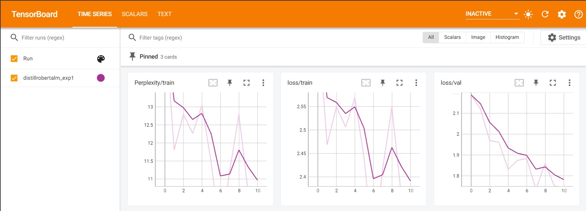
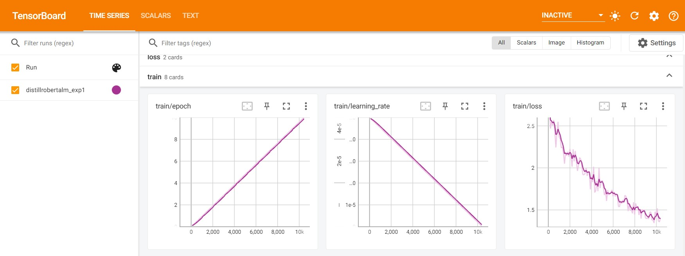

# LLM
Experiment notebooks with large language models on different datasets demonstrating different techniques like fine tuning pretrained models.

## EXPERIMENT 1
**DATASET** - Numer_sense

**FINE TUNE MODEL** - distillroberta-base

**EPOCHS** - 10

**BATCH SIZE** - 8

**LOSS AND PERPLEXITY PLOTS**

